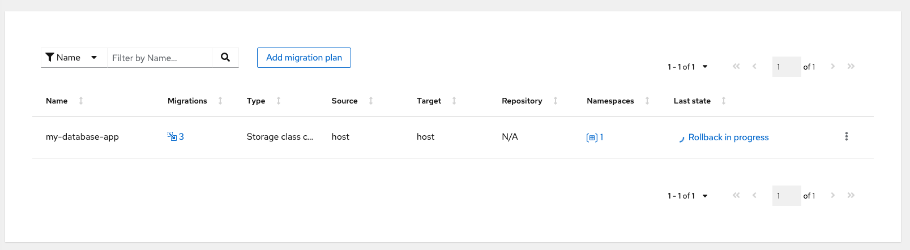

# OpenShift PVC Storage Class conversion using MTC

<style>
img[alt="screen"] { width: 550px; margin-left: auto; margin-right: auto; display: block;}
img { width: 550px; margin-left: auto; margin-right: auto; display: block;}
</style>
OpenShift PVC Storage Class conversion using MTC

- [OpenShift PVC Storage Class conversion using MTC](#openshift-pvc-storage-class-conversion-using-mtc)
    - [Environment](#environment)
    - [1. install openshift Migration toolkit for container operator](#1-install-openshift-migration-toolkit-for-container-operator)
    - [2. Deploy Test Application](#2-deploy-test-application)
    - [3. Create Migration Plan](#3-create-migration-plan)
    - [4. Application Migration : Staging](#4-application-migration--staging)
    - [5. Application Migration : Cutover](#5-application-migration--cutover)
    - [5. Application Migration : Rollback](#5-application-migration--rollback)


### Environment
- Red Hat OpenShift Container Platform 4.10.18
- UPI deployment on vsphere  (new install)
- vmware vsphere 6.7 U3
- vCenter 7.0
### 1. install openshift Migration toolkit for container operator

- log on to openshift web console -> Operator -> Operator Hub
- Search for "migration toolkit"
- Select **"Migration Toolkit for Containers Operator"**
¸  
- Click **Install**
  

- Confirm MTC will be install in "openshift-migration" namespace , click **install**
  
- wait until operator successfully installed
  
- when operator installed, click **"View Operator"**
  
  
- locate to MigrationController in operation menu
  
- click "Create MigrationController"

  
- Click **"Create"**
  

- Visit Workloads -> Pods in project "openshift-migration", verify that migration controller and velero component deployed and running
  
- go to networking -> routes, in project "openshift-migration", click URL shown in migration location
  
- after log on we will have migration toolkit for storage class conversion
  

### 2. Deploy Test Application

- log on to openshift cluster using oc command
- create new project to test application

  ```bash
  oc new-project my-database-app
  ```

- deploy application using "thin" storage class , this will deploy rail application with postgres db connect to PVC 2GiB

  ```bash
  oc new-app -f manifests/rail.yaml -p STORAGE_CLASS=thin -p VOLUME_CAPACITY=2Gi
  ```

  output

  ```console
  --> Deploying template "my-database-app/rails-pgsql-persistent-storageclass" for "rail.yaml" to project my-database-app

       Rails + PostgreSQL + Configurable StorageClass
       ---------
       An example Rails application with a PostgreSQL database. For more information about using this template, including OpenShift considerations, see https://github.com/sclorg/rails-ex/blob/master/README.md.

       The following service(s) have been created in your project: rails-pgsql-persistent, postgresql.
       
       For more information about using this template, including OpenShift considerations, see https://github.com/sclorg/rails-ex/blob/master/README.md.

       * With parameters:
          * Name=rails-pgsql-persistent
          * Namespace=openshift
          * Memory Limit=512Mi
          * Memory Limit (PostgreSQL)=512Mi
          * Volume Capacity=2Gi
          * Volume Storage Class=thin
          * Git Repository URL=https://github.com/sclorg/rails-ex.git
          * Git Reference=
          * Context Directory=
          * Application Hostname=
          * GitHub Webhook Secret=2XW32YlmWCCVM2t438vyTdyGWTXJiy4wBQWfvYfj # generated
          * Secret Key=3ph1x37o860qk8wqek7jhorqm8pvom6qo7fwolqr1fc53ktyjnxsjeh8kpy6h6ywqfsngaxl7bgivbki2akehm2f7d3f4vtdjilbrfgbfr2ac6ovclxdrubu8ob1soe # generated
          * Application Username=openshift
          * Application Password=secret
          * Rails Environment=production
          * Database Service Name=postgresql
          * Database Username=userEHO # generated
          * Database Password=NKTfDlYR # generated
          * Database Name=root
          * Maximum Database Connections=100
          * Shared Buffer Amount=12MB
          * Custom RubyGems Mirror URL=

  --> Creating resources ...
      secret "rails-pgsql-persistent" created
      service "rails-pgsql-persistent" created
      route.route.openshift.io "rails-pgsql-persistent" created
      imagestream.image.openshift.io "rails-pgsql-persistent" created
      buildconfig.build.openshift.io "rails-pgsql-persistent" created
      deploymentconfig.apps.openshift.io "rails-pgsql-persistent" created
      persistentvolumeclaim "postgresql" created
      service "postgresql" created
      deploymentconfig.apps.openshift.io "postgresql" created
  --> Success
      Access your application via route 'rails-pgsql-persistent-my-database-app.apps.acs.rhdemo.local' 
      Build scheduled, use 'oc logs -f buildconfig/rails-pgsql-persistent' to track its progress.
      Run 'oc status' to view your app.
  ```

- access OCP web console, go to Workloads -> Pods in "my-database-app" namespace , verify both postgresql and rail application pod up and running
  
- go to Storage -> PersistentVolumeClaims, Verify PVC "postgresql" created with capacity 2 GiB and using storage class "thin"
  
- go to Networking -> Routes, Click URL of rails-gpsql-persistent route

- with Welcome page appear , manual input URI path **"/articles"** , then press enter
  
- In Articles application, try insert some article
- If authentication popup appear, insert username "openshift" password "secret"
  
  

### 3. Create Migration Plan

- Go to Migration Tookit for Containers URL (URL locate in Networking -> Routes within project "openshift-migration")
  
- Go to "Migration plans", click "Add migration plan"
  
- insert plan name
- migration type : "Storage class conversion"
- Source Cluster : "host"'
- click "Next"
  
- Select namespace , click next

- wait until PVC are populated
  
- verify PVC information
- change "Target storage class" to "thin-csi:csi.vsphere.vmware.com" or desired storage class
- click "Next"


- **"Verify copy"** can be selected but significantly increase copy time
  
- confirm warning and close plan
  
- confirm "Last state" is ready
  

### 4. Application Migration : Staging

- Access MTC URL, go to Migration plans
- select plan, click three dots icon on the right, select **"Stage"**
  
- confirm precedure description, click "Stage"

- Wait for staging to complete, click Migrations icon for more process detail
  
  
- Go back to OCP web console, in project "my-database-app"
- Go to Storage -> PersistentVolumeClaim
- Verify new PVC created with name related to original PVC ( origin-name with "-new") and desired storage class
  
- (optional) go back to application, create some updated on article
  
### 5. Application Migration : Cutover
- Go to migration toolkit dashboard
- Go to migration plans, click 3 dots icon at the right of the plan
- Select Cutover
  
- Review Cutover warning
- click **"Migrate"**
  
- By click on plan, you can monitor process of PVC cutover
  
- Go to application, review persistent data are valid from staged and accurrate
  
- Test create new data after cutover
  
- Confirm application are read and writh PVC data are functional
  
- Go to Workloads-> DeploymentConfigs -> postgresql -> YAML tab
- verify spec volumes mapping are change to new PVC
  
### 5. Application Migration : Rollback
- Go to migration toolkit dashboard
- Go to migration plans, click 3 dots icon at the right of the plan
- Select **"Rollback"**

- Review rollback warning
- Click "Rollback"
  
- wait untill rollback process finished
  
  
- Go to OpenShift web console
- Verify only origin PVC left in namespace

- Check with deployment yaml, PVC mapping are converted to original PVC

- Check on application, data written on migrated PVC before rollback are missing (revert to before cutover)
